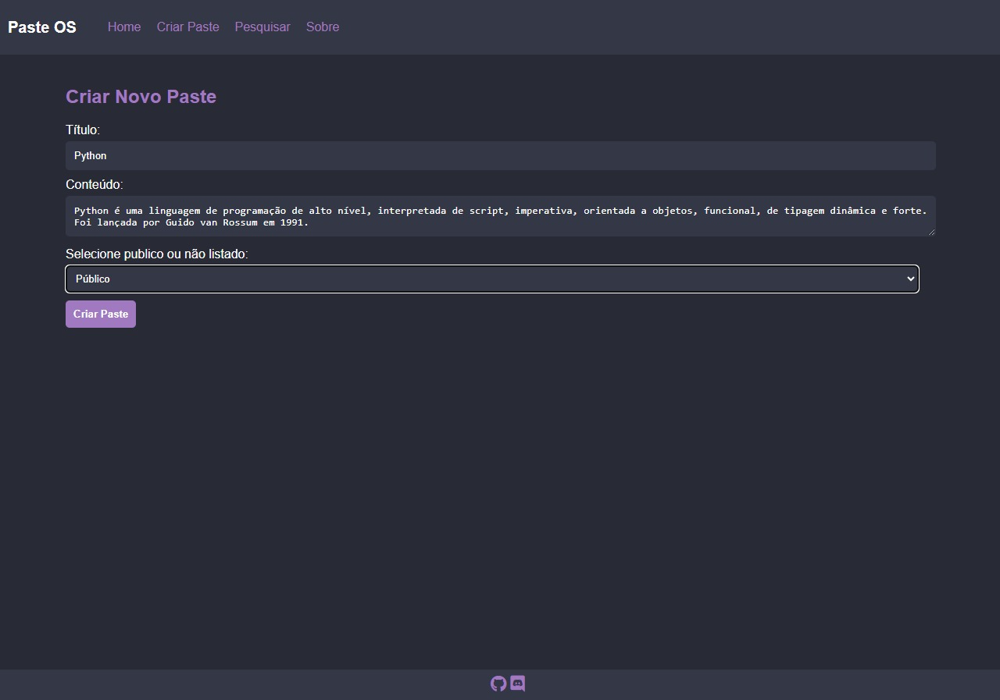
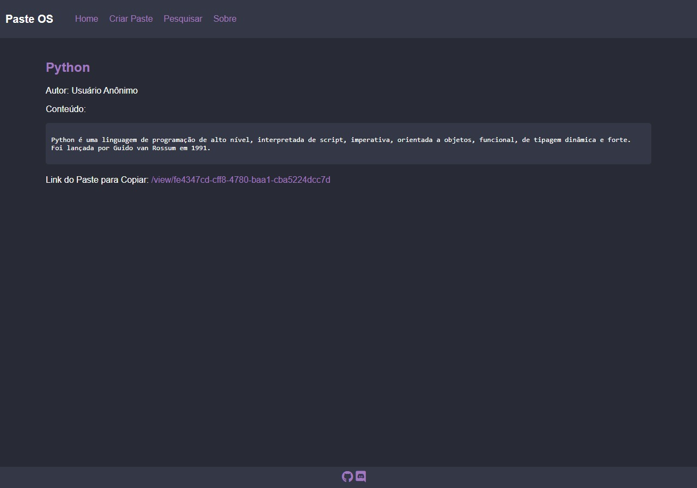
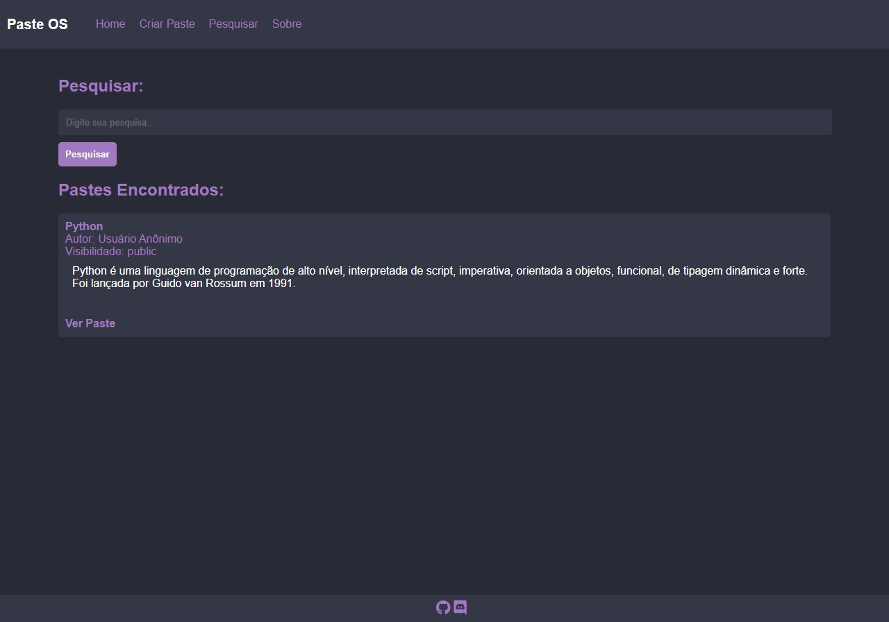

# PasteOP

PasteOP is an open-source system inspired by PasteBin, developed using the Flask framework. This project provides a simple and comprehensive solution for managing and sharing texts or information.

[Português](README_pt.md) | English

[](https://github.com/kensdy/PasteOP)

## How to Use

1. **Prerequisites:**
   - Make sure you have Python installed on your machine.

2. **Cloning the Repository:**
   - Execute the following command to clone the repository:
     ```bash
     git clone https://github.com/kensdy/PasteOP
     ```

3. **Running the Application:**
   - Navigate to the newly cloned directory with `cd PasteOP`.
   - Install dependencies using `pip install -r requirements.txt`.
   - Run `python main.py` to start the local server.
   - Access `http://127.0.0.1:5000` in your browser to interact with the forum.

The system presents a dynamic platform for creating posts, providing a flexible and adaptable experience for users. Posts can be created publicly, ensuring visibility, or configured as unlisted, allowing selective sharing. This functionality promotes a versatile approach to information disclosure, catering to both the needs of broad communication and more restricted privacy.

Additionally, the system includes a search feature, allowing users to explore and discover public pastes. This search capability among shared content enhances the system's utility, facilitating the location of specific information within the vast database of public posts. This approach adds value to the system, providing an efficient and intuitive way to explore and access relevant content within a sharing community.

## **Understanding the Features**

PasteOP introduces various features aimed at providing a robust and user-friendly experience:

### 1. Home Page

The Home Page displays a text about the project.

### 2. Paste Creation Page

On the Paste Creation Page, users can create public and unlisted pastes. Public pastes appear in searches, while unlisted pastes do not appear in searches, requiring a link to be accessed.


### 3. Paste Reading Page

The Paste Reading Page allows users to access specific pastes for reading.


### 4. Search System

On this page, users can search for terms or phrases in public pastes, returning pastes that contain the searched terms.

