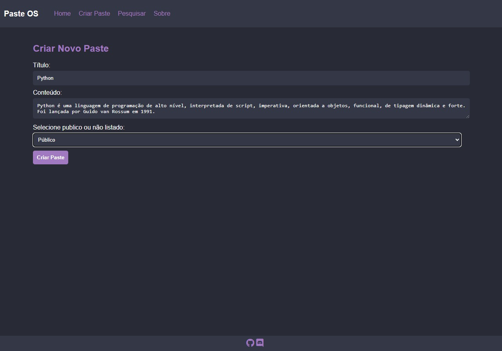

# PasteOP

O PasteOP é um sistema open-source inspirado no PasteBin, desenvolvido utilizando o framework Flask. Este projeto oferece uma solução simples e abrangente para a gestão e compartilhamento de textos ou informações.

Português | [English](README.md)

[](https://github.com/kensdy/PasteOP)

## Como Usar

1. **Pré-requisitos:**
   - Certifique-se de ter o Python instalado em sua máquina.

2. **Clonando o Repositório:**
   - Execute o seguinte comando para clonar o repositório:
     ```bash
     git clone https://github.com/kensdy/PasteOP
     ```

3. **Executando o Aplicativo:**
   - Navegue para o diretório recém-clonado com `cd PasteOP`.
   - Instale as dependências usando `pip install -r requirements.txt`.
   - Execute `python main.py` para iniciar o servidor local.
   - Acesse `http://127.0.0.1:5000` em seu navegador para interagir com o fórum.

O sistema apresenta uma plataforma dinâmica para a criação de posts, proporcionando uma experiência flexível e adaptável aos usuários. Os posts podem ser elaborados de forma pública, garantindo visibilidade, ou configurados como não listados, permitindo o compartilhamento seletivo. Essa funcionalidade promove uma abordagem versátil para a divulgação de informações, atendendo tanto às necessidades de comunicação ampla quanto à privacidade mais restrita.

Além disso, o sistema inclui uma funcionalidade de busca, permitindo aos usuários explorar e descobrir pastes públicos. Essa capacidade de pesquisa entre os conteúdos compartilhados amplia a utilidade do sistema, facilitando a localização de informações específicas dentro da vasta base de dados de posts públicos. Essa abordagem agrega valor ao sistema, oferecendo uma maneira eficiente e intuitiva de explorar e acessar conteúdos relevantes em meio a uma comunidade de compartilhamento.

## **Conhecendo as Funcionalidades**

O Community apresenta diversas funcionalidades que visam proporcionar uma experiência robusta e amigável para os usuários:

### 1. Página Inicial (Home)

A Página Inicial exibe um texto sobre o projeto.

### 2. Página de Criação de Pastes

Na Página de Criação de Pastes, os usuários podem criar pastes públicos e não listados. Pastes públicos aparecem nas buscas, enquanto pastes não listados não aparecem nas buscas, precisando de um link para poderem ser acessados.


### 3. Página de Leitura de Pastes

A Página de Leitura de Pastes permite que os usuários acessem pastes específicos para leitura.


### 4. Sistema de Buscas

Nesta página, o usuário pode pesquisar termos ou frases em pastes públicos, retornando pastes que possuem os termos pesquisados.

